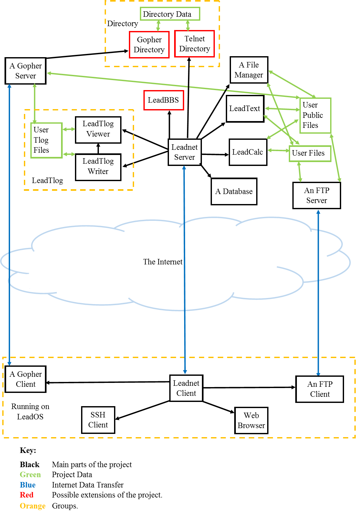

# leadnet
Leadnet is a telnet-based cloud productivity suite for Linux.  This repository holds both client and server portions.

## Project Plan
The project consists of the Server side and the Client side.

### Server Side
The server side consists of the following components:

1. The Leadnet Server - this is a telnet server that allows the user to login, then gives them a choice of applications.  It then redirects I/O streams to/from the program that handles the chosen application.  Applications should block ^Z signals for security reasons.
2. LeadText - this is a full command-line word processor (loosely based on ProText).
3. LeadCalc - this is a command-line spreadsheet program.
4. A database - probably MySQL so it doesn't need to be built from scratch, just somehow integrated in so users can have simple database applications.
5. LeadTlog - This is essentially a telnet blogging system, so users can have a "telnet accessible blog" (or "Tlog").  LeadTlog is comprised of two applications:
  * LeadTlog Writer - the program for users to write their Tlogs.
  * LeadTlog Viewer - the program for viewing user's Tlogs.  This should be accessible from the Guest account.
6. A gopher server - probably use QSelf (though it's freeware, not open-source) so it doesn't need to be built from scratch.  The gopher server offers another way to access Tlogs and any documents that users have made publicly available.  QSelf is probably the only gopher server with full CGI integration, so a script can be used to generate the menu-pages for various Tlogs.  These scripts *will* need to be written as part of the project.
7. An FTP server - probably use an existing FTP server.  This is so users can access their documents directly if necessary.  They *will* be able to download their files using Telnet Binary transfer anyway, but this will provide another method to do so that will not require a special client.
8. A File Manager - to choose which files are public, to delete files, to move and copy files, etc.  This could be made by the project-team or it could be a separate program.

Possble other components to include server-side:

9. LeadBBS - a Bulletin Board System so users can communicate and possibly discuss collaborations.
10. LeadDirectory - a directory project consisting of:
  * A Telnet Directory - a telnet accessible and searchable directory of other Telnet servers providing useful services.
  * A Gopher Directory - a gopher accessible and searchable (using type 7 scripts) directory of Telnet servers and gopher servers providing useful services.

### Client Side
The client side primarily consists of the Leadnet Client.  This is a Telnet client that can have multiple connections at a time using tabs (like a modern web-browser, but for Telnet).  Telnet Binary transfers are automatically downloaded to a set download directory, so users can save their documents locally if needed (this is useful for downlading .ps files for printing).  The escape character ^] (\035) allows users to use the arrow keys to move the cursor around the screen and select parts of the display to save, or to select a displayed URI to open in another tab or a separate program.  Other programs can be set up as the default for handling non-Telnet URIs.  Ones likely to be needed are those for gopher, SSH, FTP and the web.  These should not need to be built by the project-team as there should be many options for each.
There could be a LeadOS for running the client (ideally configured to open it on boot), but any lightweight command-line version of Linux will do.  Core (previously MicroCore) would be a good possibility, though the download folder should then be located directly on the HDD rather than in the home directory in order to allow a system running it to boot quickly.
The Ideal scenario would be to eventually create a "LeadBook" - a small laptop running whatever is eventually chosen as the LeadOS, that boots directly into the Leadnet Client, for use as a cheap productivity machine for remote working.  This, however, would be an expensive part of the project and not required by users as the Leadnet Client should work on all Linux systems (if not as many other UNIX-like systems as possible).
